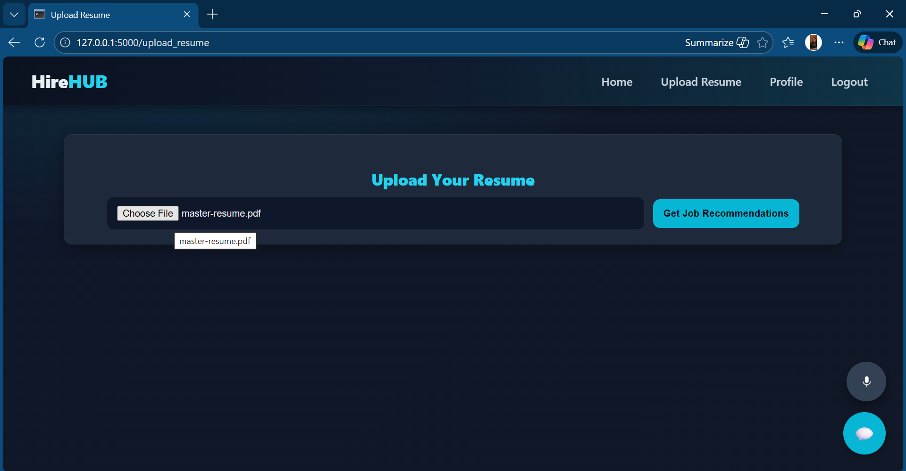
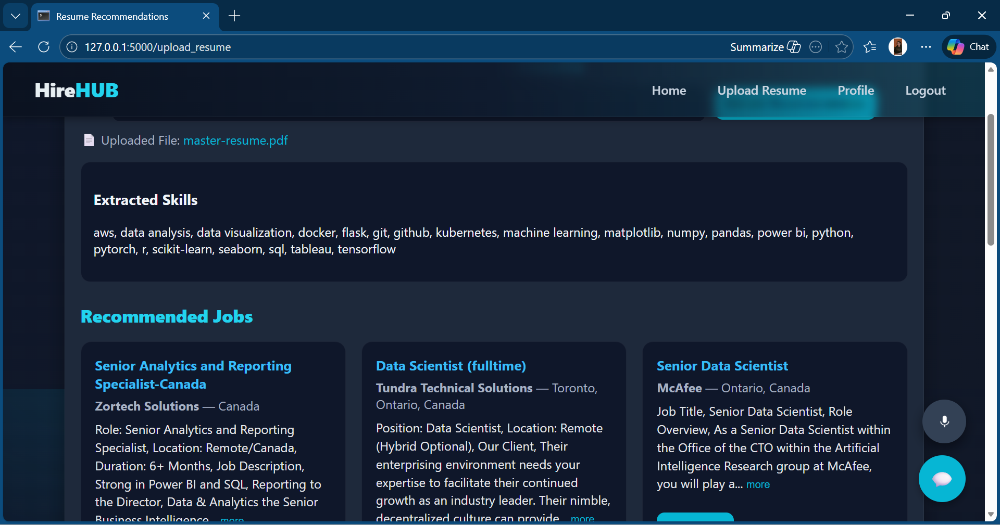
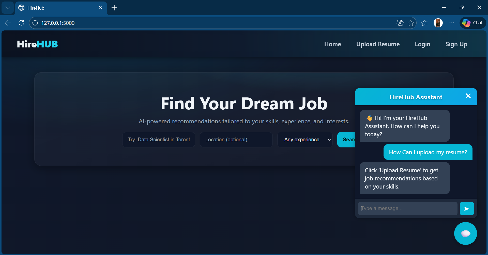
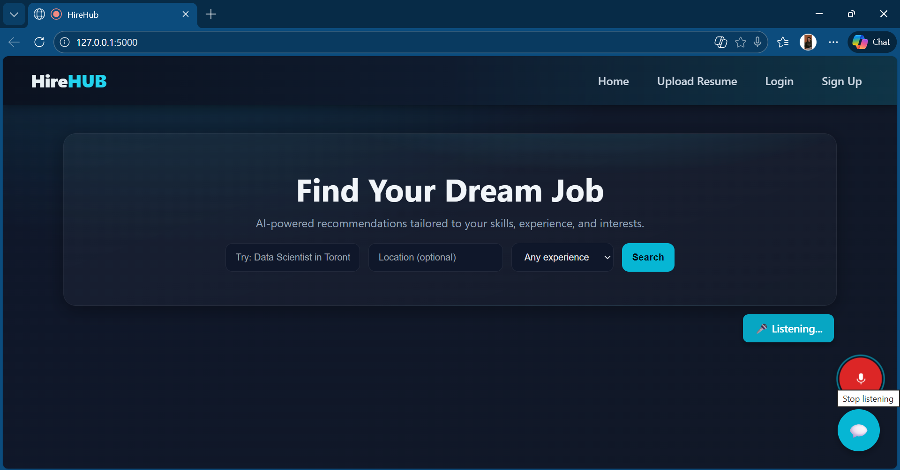

# 🚀 HireHub – Job Recommendation System using Hybrid Filtering  

HireHub is an AI-powered Job Recommendation System that recommends highly relevant jobs using **Hybrid Filtering**, combining **Content-Based Similarity (TF-IDF)** and **Popularity Scoring**.  
It provides advanced features such as **Resume Parsing (PDF/DOCX)**, **Automatic Skill Extraction**, **Voice-Based Job Search**, and a **Chatbot Assistant** inside a modern UI.

---

## 🌟 Features

- 🔍 **Smart Keyword-Based Job Search**  
- 📄 **Resume Upload (PDF/DOCX)** with automatic text extraction  
- 🧠 **Skill Extraction** from resume text  
- 🎙 **Voice Search** for hands-free job queries  
- 🤖 **Chatbot Assistant** for instant help  
- ⭐ **Hybrid Recommendation Algorithm**  
  - 70% Textual Similarity (TF-IDF)  
  - 30% Job Popularity  
- 👤 **Login & Signup System** (SQLite-based)  
- 💾 **Save Jobs to User Profile**  
- 🖥 **Dark-Themed Modern UI** inspired by professional job portals  

---

## 📊 Dataset

This project uses the Kaggle dataset of job postings.

🔗 **Dataset Link:**  
https://www.kaggle.com/datasets/kanchana1990/linkedin-canada-data-science-jobs-2024

⚠️ The dataset is **NOT included** in this repository due to Kaggle licensing restrictions.

---

## 🖼️ UI Preview 

### 🏠 Home Page  

### 📄 Resume Upload Page  

### 🎯 Job Recommendations  

### 💬 Chatbot + Voice Search  

### 💬 Voice Search 

---

## ⚙️ Tech Stack

### **Backend**
- Python (Flask)
- Scikit-Learn (TF-IDF Vectorizer)
- Cosine Similarity
- Hybrid Filtering Algorithm
- SQLite Database

### **Frontend**
- HTML, CSS, JavaScript  
- Custom Voice Search Module  
- Chatbot Interaction Window  
- Tailored Dark UI Theme  

### **Resume Parsing**
- PDFMiner (PDF)
- docx2txt (DOCX)

---

## 🚀 How It Works

### 🧩 1. Resume Parsing  
Extracts text using PDFMiner / docx2txt → then extracts relevant skills.

### 🧮 2. TF-IDF Vectorization  
Creates a numerical representation of jobs and queries.

### 🧠 3. Content-Based Similarity  
Uses **Cosine Similarity** to match resume/query text to the job dataset.

### ⭐ 4. Hybrid Scoring  
Final ranking =  
Hybrid Score = 0.7 * similarity + 0.3 * popularity

### 🎙 5. Voice Input  
Uses Web Speech API to let users search for jobs using voice commands.

### 🤖 6. Chatbot  
A guided chatbot to help users find jobs or understand platform features.

---